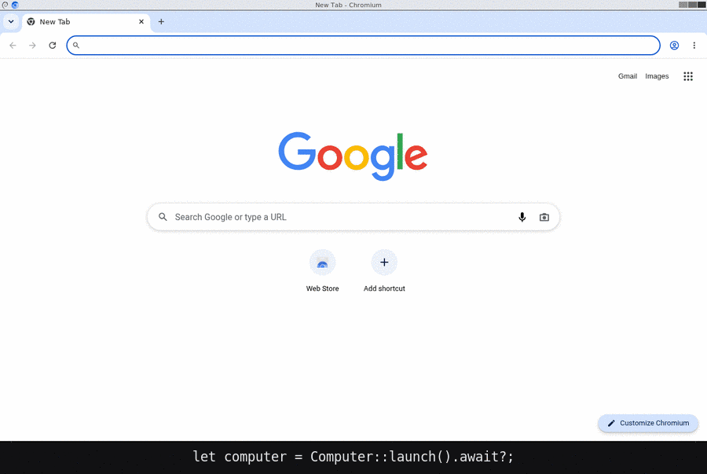

# Computer

`computer` provides isolated desktop boxes that agents can use to complete and drive real tasks. Each computer runs a Linux desktop inside a container or microVM, where an agent can open web pages, drive native apps, take screenshots, move the pointer, type text, run commands, and transfer files. You can also watch the agent work or take control through a browser when it needs help.



## Requirements

Install Rust and one supported runtime:

- Docker
- Podman
- nerdctl
- microsandbox, for a microVM instead of a container

You do not need to download or build a desktop image. The crate contains the image source and builds it when you launch the first desktop.

## Quick start

One crate holds both halves.

For the commands, take a build rather than compiling one:

```bash
curl -fsSL https://raw.githubusercontent.com/CITGuru/computer/main/scripts/install.sh | sh
```

macOS and Linux, on x86-64 and arm64. You get two: `computer`, which drives a box from a shell and serves MCP to an agent, and `computerd`, the server that keeps running. `COMPUTER_INSTALL_DIR` moves them and `COMPUTER_VERSION` pins a tag.

To drive a desktop from your own program, take the API:

```toml
[dependencies]
computer = { git = "https://github.com/CITGuru/computer", default-features = false }
tokio = { version = "1", features = ["macros", "rt-multi-thread"] }
```

`default-features = false` leaves out the commands and everything they need.

From this repository, you can run the bundled example:

```bash
cargo run --example quickstart
```

The basic API is:

```rust
use computer::{Button, Computer, Point};

#[tokio::main]
async fn main() -> computer::Result<()> {
let computer = Computer::launch().await?;

let viewer_url = computer.viewer_url().unwrap_or_default();
tracing::info!(%viewer_url, "desktop is ready");

computer.open_url("https://example.com").await?;
computer.click(Point::new(640, 81), Button::Left).await?;
computer.type_text("driven from rust").await?;

let png = computer.screenshot().await?;

computer.shutdown().await
}
```

`Computer::launch()` starts one 1280x800 screen. The viewer URL lets you watch that screen in a browser. `shutdown()` stops and removes the container.

## What is inside the box

Each box uses `debian:bookworm-slim` and includes:


| Component                           | Purpose                                                    |
| ----------------------------------- | ---------------------------------------------------------- |
| `Xvfb`                              | Provides a virtual X server for each screen                |
| `fluxbox`                           | Manages windows and keyboard focus                         |
| `chromium`                          | Provides a browser with a separate profile for each screen |
| `x11vnc`, `websockify`, and `noVNC` | Let you view and control the desktop from a browser        |
| `xdotool`                           | Controls the pointer, keyboard, and scrolling              |
| ImageMagick `import`                | Captures PNG screenshots                                   |
| `xclip`                             | Reads and writes the clipboard and primary selections      |
| `socat`                             | Bridges the DevTools port to one the runtime can forward   |
| An `xdotool` guard                  | Refuses input from anything while a person has the screen  |


The image tag includes a hash of its source files. When an image source file changes, the crate creates a new tag. `tests/image.rs` checks that the code and image configuration agree. These checks do not need a container runtime.

## Control the desktop

Use coordinates from a recent screenshot. The top-left corner is `(0, 0)`. Coordinates are device pixels.

```rust
let png = computer.screenshot().await?;
computer.move_to((640, 400)).await?;
computer.click((640, 400), Button::Left).await?;
computer.double_click((640, 400), Button::Left).await?;
computer.drag((100, 100), (400, 300), Button::Left).await?;
computer.type_text("hello").await?;
computer.key("ctrl+shift+p").await?;
computer.scroll((640, 400), Delta::down(3)).await?;
computer.scroll((640, 400), Delta::right(3)).await?;
let pointer = computer.cursor().await?;
```

Common key names work as expected. For example, the crate converts `enter` to `Return`, `cmd` to `super`, and `pageup` to `Prior`. Other names pass directly to `xdotool`.

`scroll` turns the wheel at a point, in notches, so whatever sits under that point moves rather than whatever holds focus. Positive `dy` goes down and positive `dx` goes right; a `Delta` carrying both is one diagonal gesture and not two.

From the command line the same gesture has a shorter spelling, and the point is optional:

```bash
computer scroll <box> down            # three notches, at the middle of the screen
computer scroll <box> right 6
computer scroll <box> 640 400 up 2    # at a point
computer scroll <box> 640 400 -2 -2   # both axes at once
```

### Important coordinate rules

- Screenshots do not show the pointer. Use `cursor()` when you need its current position.
- Do not calculate a click from a scaled screenshot.
- Take a new screenshot after a person or another process changes the desktop. Old coordinates might no longer select the correct item.

## Work with files and commands

You can run commands and move files between the host and the desktop:

```rust
let output = computer.exec(["ls", "-la", "/tmp"]).await?;
computer.write_file("/tmp/input.png", &bytes).await?;
computer.download("/tmp/output.gif", "output.gif").await?;

let endpoint = computer.devtools();
let logs = computer.logs().await?;
```

`devtools()` returns the Chrome DevTools Protocol endpoint for screen 0.

### Which page a coordinate addresses

`open_url()` opens a **new tab and raises it**. Every coordinate you worked out from an earlier screenshot then belongs to a page that is no longer on screen, and a click sent against one of them lands on the new page — silently, because a frame never says which page it is.

The desktop API points at pixels and the browser thinks in pages. These join them:

```rust
let mut page = computer.browser().unwrap()
    .open_page("https://example.com", Duration::from_secs(20)).await?;

computer.open_url("https://example.net").await?;   // this takes the screen
assert!(!page.visible().await?);                    // so the first page is not it

page.bring_to_front().await?;                       // and back
assert!(page.visible().await?);
```

`visible()` asks the page itself, so it is an answer rather than a guess about tab ordering. `Devtools::visible_page()` goes the other way — it hands you the page the screen is actually showing.

Take a fresh screenshot after anything opens a tab, or put the page you meant back in front first.

Every command is bounded. `exec` gives up after two minutes, as does each call the driver makes for you, so a screen that stops answering does not hold your program. Use `exec_within(argv, duration)` when a command needs a different limit.

## Use the clipboard

Each screen has its own selections. Text copied on screen 0 is not on screen 1.

```rust
computer.set_clipboard("ready to paste").await?;   // ctrl+v pastes this
let text = computer.clipboard().await?;

computer.set_selection(Selection::Primary, "middle-click paste").await?;
let dragged = computer.selection(Selection::Primary).await?;
```

X11 has two selections, and they hold different text. `CLIPBOARD` is what copy and paste uses. `PRIMARY` is what dragging the mouse over text fills, and what a middle click pastes. Reading one when you meant the other returns text that looks correct and is not.

Reading a selection that holds nothing returns an empty string, because a screen where nobody has copied anything yet is normal.

A selection is not only text. Whoever owns one offers it in several types, and a picture copied out of a page is offered as `image/png`:

```rust
let offered = computer.clipboard_targets(Selection::Clipboard).await?;
let png = computer.clipboard_bytes(Selection::Clipboard, "image/png").await?;
computer.set_clipboard_bytes(Selection::Clipboard, "image/png", &bytes).await?;
```

While a person controls the screen, you can read the selections but not write them.

## Control Chromium directly

Synthetic input goes through the screen, so its coordinates come from a screenshot. The DevTools protocol asks the browser instead, and works even when no screen is running.

```rust
let browser = computer.browser().expect("a published DevTools port");

let mut page = browser
    .open_page("https://example.com", Duration::from_secs(20))
    .await?;

page.title().await?;
page.evaluate("document.querySelectorAll('a').length").await?;
page.screenshot().await?;                    // the page, without the window
page.navigate("https://example.org").await?;
```

`Page::call` sends any protocol method and returns the answer, so you can use parts of the protocol this crate does not wrap. Use `open_page` rather than `open` followed by a wait: a new tab shows `about:blank`, which is already loaded, so a wait returns before your page arrives.

### Isolate browser sessions with groups

A browser group is a Chromium browser context inside screen 0. Groups share the Chromium process but keep cookies, local storage, IndexedDB, and service workers separate:

```rust
let browser = computer.browser().expect("a published DevTools port");
let group = browser.create_group().await?;

let mut page = group
    .open_page("https://example.com", Duration::from_secs(20))
    .await?;

page.evaluate("localStorage.setItem('agent', 'one')").await?;
group.close().await?;
```

This is additive. `Devtools::open_page` still uses the default browser context, each screen still has its own browser profile, and `BrowserGroup::open_page` creates a page in the group. Use `groups()` to list non-default contexts and `pages()` or `targets()` on a group to list what it owns.

Groups do not create screens. Many group pages can run through CDP at the same time, but they belong to screen 0's Chromium and only one can be frontmost on the desktop. Call `bring_to_front()` before using screen coordinates. Cleanup is explicit because dropping a Rust value cannot await Chromium's disposal command.

This API wraps CDP browser contexts, not Chrome's visual tab groups. Visual tab groups are part of the extension-only `chrome.tabGroups` API.

## Configure a desktop

Use the builder when you need settings other than the defaults:

```rust
let computer = Computer::builder()
    .size(1920, 1080)
    .network(false)
    .memory("2g")
    .runtime("podman")
    .name("my-box")
    .keep_on_drop(true)
    .launch()
    .await?;
```

- `network(false)` blocks outbound network access.
- `runtime()` also accepts `nerdctl`.
- `keep_on_drop(true)` leaves the container running when the handle is dropped.
- `expires_after(duration)` removes the desktop when the time runs out.

### Change the wallpaper

`set_wallpaper` sends image bytes into the box and applies them to one screen:

```rust
computer.set_wallpaper(&std::fs::read("background.png")?).await?;

let second = computer.screen(ScreenId(1)).await?;
second.set_wallpaper(&bytes).await?;
```

The display stack reads the format from the bytes, so PNG and JPEG both work. `Computer::set_wallpaper` changes screen 0. X11 applies it with `hsetroot`, Wayland through the compositor. A profile that declares no wallpaper support returns `Unsupported` rather than accepting the bytes and changing nothing.

### Record the screen

`recording` builds a GIF from screenshots, and needs nothing extra. For real video, add a recorder:

```rust
let computer = Computer::builder().packages(Extras::video().packages).launch().await?;

computer.record(Duration::from_secs(10), "/tmp/screen.mp4").await?;
computer.download("/tmp/screen.mp4", "screen.mp4").await?;
```

The capture runs inside the box for the whole duration, so the call takes at least that long. Sound is included when the box has a sound card, which `Extras::audio()` adds. Each screen has its own sink, so screen 1 records screen 1.

### Add fonts and packages

The image includes Latin fonts, which is enough for most Western pages and keeps the image small. Add more when you need them:

```rust
Computer::builder()
    .wide_fonts()                    // Chinese, Japanese, Korean, and emoji
    .packages(["vim", "curl"])       // anything else from Debian
```

`Extras::audio()` adds a sound card, `Extras::video()` adds a recorder, and `Extras::everything()` adds all three sets.

`Extras::x11_apps()` puts Xwayland in the Wayland image, so an X11 program can run on a compositor. Opt-in, because it is a trade: about seventy megabytes resident, paid by every box that carries it whether or not an X11 program is ever started. Without it that image has no X server at all, and an X11 program fails to open a display rather than failing to draw.

The package list is part of the image tag, so each list builds its own image and no desktop receives a list it was not built with. The first launch with a new list takes as long as installing those packages. `wide_fonts()` adds about 100 MB.

Without those fonts, a page in Chinese, Japanese, or Korean shows empty boxes, and so does emoji. The screenshot still looks like a working page.

By default, the crate removes a desktop when its handle is dropped. This also cleans up the container if the program panics. `shutdown()` performs the same cleanup and returns its result.

### Run on Wayland instead of X11

Two images ship. `X11Profile` is the default — Xvfb, fluxbox, x11vnc and `xdotool`. `WaylandProfile` runs the same box on sway headless, wayvnc, `grim` and `wtype`:

```rust
let computer = Computer::builder()
    .profile(Arc::new(WaylandProfile))
    .launch()
    .await?;
```

Everything above the image is the same. The ports, the verbs, the screen numbering, the takeover protocol and the whole `Desktop` API are this crate's convention rather than X11's, so the code you write does not change.

Three things differ inside the box:


|         | X11                   | Wayland                                                               |
| ------- | --------------------- | --------------------------------------------------------------------- |
| Server  | `Xvfb` plus `fluxbox` | `sway`, headless                                                      |
| Capture | ImageMagick `import`  | `grim`                                                                |
| Input   | `xdotool`             | `computer-input` — sway IPC for the pointer, `wtype` for the keyboard |
| Viewer  | `x11vnc -viewonly`    | `wayvnc -d`                                                           |
| Runs as | root                  | an unprivileged user, because sway will not start as root             |


Screens are told apart differently. An X display number is global, so screen `N` is `:N+1`. A Wayland socket is a file, so every screen's compositor is `wayland-1` inside its own `XDG_RUNTIME_DIR`.

Wayland input needs no extra privilege. It does **not** use `ydotool` or `/dev/uinput`, so the box keeps the isolation it was started with.

`cursor()` **behaves differently.** No Wayland protocol lets a client read the global pointer position, so the driver reports where it last put the pointer. Once a person has driven the screen that value is stale, and `cursor()` returns `Error::Unsupported` until your next move:

```rust
computer.move_to((640, 400)).await?;
assert_eq!(computer.cursor().await?, Point::new(640, 400));

let takeover = computer.hand_over().await?;
takeover.end().await?;

// A person moved a pointer this driver did not move.
assert!(computer.cursor().await.is_err());
```

### Use a different image or display server

Each box speaks one image contract — a `Profile` — and is driven through one `DesktopFactory`. A profile names the ports its image serves, the commands it installs, the environment it reads, what it claims to support, and **the driver it expects**. So an image and the way it is driven cannot be paired wrongly by omission. Use `.driver()` only to drive an image differently from the way its own profile says:

```rust
let computer = Computer::builder()
    .profile(Arc::new(X11Profile))
    .driver(Arc::new(MyCdpDriver))
    .launch()
    .await?;
```

A new display server needs a `Desktop` and a `DesktopFactory`. A new image contract needs a `Profile`; an image that keeps an existing contract can reuse its profile. The screens, the takeover gate, the leases, and the file transfer are written against the traits.

A profile also supplies `screen_env()` — the variables one screen's commands run with. X11 sets `DISPLAY=:N+1` there; Wayland sets `WAYLAND_DISPLAY` and `XDG_RUNTIME_DIR`. A `Machine` never learns what a screen is: it moves an environment the profile already built.

`support().display.server` reports the server the driver named.

`Computer::builder().config()` returns the resolved `Config` — the image tag, the ports to publish, the environment, and the boot command — so you can see what a box would be started with before anything starts.

A local directory can supply the Docker build context:

```rust
Computer::builder().image_dir("crates/computer-core/images/ubuntu")
```

`examples/custom_image.rs` builds one and drives a box in it, and `examples/images/acme/` is the whole Dockerfile: an image that keeps the X11 contract adds to the base rather than reimplementing it, which is why that file is a dozen lines. `crates/computer-core/images/ubuntu/` is the other way round — a contract built from a bare distribution, which is what a genuinely different base needs.

`crates/computer-core/images/tiny/` is a lightweight desktop image you can take for a run:

```rust
Computer::builder().image_dir("crates/computer-core/images/tiny")
```

The directory can be anywhere and must contain a `Dockerfile` that implements the selected profile. Its tag follows the context contents, extra packages and host architecture, so an edit builds a new image instead of reusing stale bytes. Extra packages are passed as the `EXTRA_PACKAGES` build argument.

An image you name yourself is always fetched, never built:

```rust
Computer::builder().image("someone-else/desktop:1")
```

Such an image takes no extra packages, because there is no build to install them in. `.image(...)` together with `.packages(...)` is refused rather than ignored.

An image says which contract it implements, and a box driven by another profile is refused before it starts:

```dockerfile
LABEL computer.profile="computer-desktop"
```

```
Denied: computer-local:905f378b… implements the computer-wayland contract and this box is driven by computer-desktop: the commands would go in and the screen would not move
```

An image that declares nothing is not refused — your own image owes this crate no label. Without one, a mismatch surfaces ninety seconds later as a display that never came up, which points at the display server rather than at the pairing.

Use `Computer::attach_using()` to attach to a box that a different profile started. Neither the profile nor the driver is recorded on the box, so the attaching process must be told which to use.

### Derive a profile from a tested one

An image that keeps most of a shipped contract needs `ProfileBuilder`, not a whole `Profile`. Whatever you do not name stays on the base:

```rust
let profile = ProfileBuilder::new(X11Profile)
    .name("my-desktop")
    .image_dir("images/mine")
    .screen_commands(CommandScreen::new("my-screen"))
    .wallpaper_runtime(CommandWallpaperRuntime::new("my-wallpaper"))
    .build();

let computer = Computer::builder().profile(Arc::new(profile)).launch().await?;
```

Whatever you leave alone comes from the base contract, so a custom image does not copy the X11 or Wayland one to change two names. `ports()`, `geometry()`, `support()`, `screen_environment()` and `viewer_url()` replace the rest. `geometry()` takes one `GeometrySpec` rather than three methods, because the default size, the environment a launch carries and the size read back off a running box have to agree.

**A profile carries its own image.** `image_dir()` puts the build context on the profile rather than on the builder, so the image and the contract it implements arrive together instead of being two things a caller has to pair correctly. The directory needs a `Dockerfile` whose `computer.profile` label matches the profile's name. `image(ImageSource::Registry("me/desktop:1".into()))` names somebody else's instead, and `Computer::builder().image_dir(...)` still wins over whatever the profile says.

`driver()` names the display server driver, which a base contract otherwise supplies — an image that keeps a contract but speaks Wayland needs its own.

`CommandScreen` keeps the command protocol and changes only the program that answers it. The three runtimes go further: `screen_runtime`, `browser_runtime` and `wallpaper_runtime` replace **how** an operation is performed, so an image with a guest agent can answer without a shell. Each has a `Command*` default, which is what the shipped images use.

### Carry a login between boxes

A box is thrown away, and everything it was logged into goes with it. A session is what a login leaves behind — cookies and local storage — and it can be taken out of one box and put into another:

```rust
let origins = ["https://example.com".to_string()];
let session = browser.export_session(&origins, Carry::default()).await?;

// … a new box, later, somewhere else …
let tabs = browser.import_session(&session).await?;
```

Named origins only. What comes out belongs to one of them, and what goes back in is checked against the list it came with, so a session for one site can never be put into another.

`Carry` says what to take. Cookies and local storage by default, because that is where a login normally is:

```rust
Carry::default()                                     // cookies + local storage
Carry { indexed_db: true, ..Carry::default() }       // and databases
Carry { local_storage: false, ..Carry::default() }   // cookies alone
Carry::all()
```

`indexed_db` is where Firebase keeps a login, so without it those sites come back signed out. It carries only what survives being written as JSON — a value holding a blob is left, and named in `session.incomplete` rather than lost quietly.

`session_storage` belongs to a **tab**, not to a browser. It is read from a tab already open on that origin, and `import_session` hands back the tabs it put it into, because one restored into a tab nobody keeps is one nobody has. A site that uses it has also decided the login should die with the tab, which is why it is asked for rather than assumed.

The profile directory is deliberately not what moves: it is about a third of a gigabyte, tied to the Chromium build that wrote it, and carries a browser's whole history besides.

### Keep the whole browser instead

Where a session is not enough — a database too large to write as JSON, a key a page will not hand over — keep the profile itself:

```rust
Computer::builder().profiles("toby-work").launch().await?;
```

A named volume, which Docker keeps when a box is removed, so two boxes given the same name are the same browser. Everything comes with it: logins, history, extensions, and whatever a session cannot carry.

The trade against a session is where it can go. A session is data a caller can put anywhere; a volume never leaves this host. And one box at a time per name, because two browsers sharing a profile directory is how one gets corrupted.

**A session is the account.** A password may sit behind a second factor; a session has already passed one, so whoever holds this is the user.

### Attach to a running desktop

Give a desktop a name if you want to use it from another process:

```rust
let computer = Computer::attach("my-box").await?;
```

The attached desktop keeps its windows, browser profile, and files. Dropping an attached handle does not remove the desktop because that handle did not create it.

## Use more than one screen

Screen IDs start at zero. Screen 0 starts with the desktop. Other screens start only when you request them.

```rust
let second = computer.screen(ScreenId(1)).await?;
second.open_url("https://example.org").await?;
```

`screen()` holds the screen for your process and gives it back when the handle is dropped, so a second caller is refused rather than handed the same screen. Use `claim(&holder, fence)` to hold one under a name of your own, `take(id, &holder, fence)` to take one from a holder that is not coming back, and `screen_unfenced(id)` when nothing else can be holding anything.

The image supports up to eight screens. Screen `N` uses these values:

```text
X display:     :N+1
View port:     6080 + 2N    read-only
Control port:  6081 + 2N    accepts input
```

The crate does not use display `:0`. On a host with a physical display, `:0` usually belongs to that display.

Each screen has separate view and control servers. Opening a read-only viewer does not give that viewer control.

## See what is on the screen

A window says what it is and where, so a caller does not have to work either
out of a screenshot:

```rust
for window in computer.primary().windows().await? {
    println!("{} {}x{} at {},{}", window.class, window.width, window.height,
             window.at.x, window.at.y);
}
```

```text
Chromium   1280x800 at 0,0
XTerm      484x316 at 1,55
Thunar     640x480 at 1,404
```

**Match on the class, not the title.** A title moves with the open document — Untitled 1 - Mousepad` becomes `notes.txt - Mousepad` the moment one is saved.

## Move a window, and wait for one

A window can be put where it is wanted, and each call answers with the window as it ended up:

```rust
let screen = computer.primary();

screen.arrange(&window.id, Arrange::Size { width: 800, height: 600 }).await?;
screen.arrange(&window.id, Arrange::At(Point::new(120, 90))).await?;

let full = screen.arrange(&window.id, Arrange::Maximise).await?;
println!("{}x{}", full.width, full.height);
```

The answer is the truth rather than the request: a window manager clamps a move to the screen, honours a resize only within the size hints the program gave it, and ignores both on a window whose place it owns.

`active_window()` says which window typing would reach. `wait_for_window()` waits for one to appear and stop moving, which is what to do about the dialog a click raised:

```rust
let dialog = screen.wait_for_window("Mousepad", Duration::from_secs(10)).await?;
```

It waits for the window to settle where it is, not for it to finish drawing: a dialog with a caret blinking in it never stops drawing. `launch` is the one that waits for paint.

## Capture part of a screen

A screenshot is the whole screen at full size. `capture` narrows it to one window or one rectangle, and shrinks what comes back:

```rust
let screen = computer.primary();

let region = screen.capture(&Shot::region(Rect::new(Point::new(100, 80), 400, 300))).await?;
let one    = screen.capture(&Shot::window(&window.id)).await?;
let small  = screen.capture(&Shot::window(&window.id).scaled(50)).await?;
```

A window is looked up when the capture is taken, not when it was listed — a window moves, and a picture of where it used to be is a picture of whatever took its place.

`scaled` is a percentage of full size. It is what stops an agent paying for a megabyte on every step: a 1280×800 desktop halves to about two thirds of the bytes with the text still readable, and quarters to a third of them. On X11 the reduction averages pixels rather than interpolating, because blurring flat colours into gradients makes a *larger* PNG than the full-size picture it was meant to save.

```bash
computer shot <box> out.png --window 42 --scale 50
computer shot <box> out.png --at 100,80 --size 400x300
```

## Hold a modifier, and wait for the drawing to stop

Shift-click extends a selection, ctrl-click adds to one. Pressing the key first does not do it — that press ends with the command that made it, so the click which follows arrives unmodified:

```rust
screen.click_with(at, Button::Left, &[Held::Shift]).await?;
screen.drag_with(from, to, Button::Left, &[Held::Ctrl]).await?;
```

`wait_until_still` is what to do instead of guessing at a sleep — after a menu opens, a dialog draws, or a page paints:

```rust
screen.wait_until_still(Duration::from_millis(400), Duration::from_secs(10)).await?;
```

The watch runs inside the box, so it costs one round trip however long it waits. A screen with something animating on it never settles and reaches the deadline instead, which is why one is asked for.

```bash
computer click <box> 640 400 left --held shift,ctrl
computer still <box> --settle 400 --within 10000
```

Modifiers are X11 only. Holding a key across a click on Wayland needs a virtual keyboard that this image's pointer does not make, so the Wayland driver refuses rather than dropping the modifier and clicking anyway.

## Give control to a person

`hand_over()` gives a person exclusive control through a browser:

```rust
let takeover = computer.hand_over().await?;
let takeover_url = takeover.url().unwrap_or_default();
tracing::info!(%takeover_url, "desktop control is ready");

let frame = computer.screenshot().await?;
let result = computer.click(at, button).await;
assert!(result.is_err());

takeover.end().await?;
```

Your program can still read the screen during a handover, but its normal input methods return an error.

Use `share()` when the person and your program must control the desktop at the same time:

```rust
let shared = computer.share().await?;
```

Shared input can race. For example, a person's click can arrive between the program's pointer move and click. Use `hand_over()` unless both sides must act at the same time.

### Wait for the person to leave

The control server stays open after the browser tab closes. Use the connection count to know when the person has left:

```rust
let takeover = computer.hand_over().await?;

computer
    .wait_until_free(Duration::from_secs(600))
    .await?;
takeover.end().await?;

let frame = computer.screenshot().await?;
```

`viewers()` returns the current `watching` and `driving` connection counts. Always take a new screenshot after a handover.

### Reclaim a desktop

A takeover can stay active if the process that created it exits. An attached process can detect and end that takeover:

```rust
let computer = Computer::attach("my-box").await?;

if computer.person_driving().await {
    computer.reclaim().await?;
}
```

The gate that holds your input back lives in your process, and the token that says who is driving lives in the box. That is why an attached process can find a takeover it never started, and why a stale `end()` is refused rather than taking the keyboard from whoever holds it now.

The image enforces the same rule. While a person has the screen, `xdotool` refuses input from anything in the box, including a raw `exec`, and returns status 3. Reads such as `getdisplaygeometry` still work, because a program that may not act may still watch.

## Run in a microVM

A container shares the host kernel. A microVM boots its own kernel and gives a stronger isolation boundary, but it starts more slowly.

Install microsandbox. No crate feature is needed: the machine drives the `msb` command, and finds it in the installer's directory even when that directory is not on your `PATH`.

Hand the image over once, then launch:

```rust
use computer::microvm::import_image;
use computer::sandboxes::microsandbox::msb;

import_image(&SystemDocker::default(), &msb::Msb::found(), &bundle::tag()).await?;

let computer = Computer::builder()
    .machine(Arc::new(msb::machine()))
    .image(bundle::tag())
    .launch()
    .await?;

let frame = computer.screenshot().await?;
```

A hypervisor keeps its own image store and cannot read a container runtime's, so `import_image` saves the image and loads it across. An OCI reference the hypervisor can pull works instead, and `export_rootfs` flattens the image into a directory for a hypervisor with no image store at all.

The desktop control API is the same for containers and microVMs. The runtime behavior is different:


| Behavior       | Container                       | microVM                                        |
| -------------- | ------------------------------- | ---------------------------------------------- |
| Isolation      | Host-kernel namespaces          | Separate guest kernel                          |
| Image          | Local runtime image             | Imported image, OCI reference, or a rootfs     |
| Ports          | Runtime selects free host ports | Crate selects ports before boot                |
| Starting up    | The image's own command idles   | The crate starts screen 0 and nothing idles    |
| Memory         | Unlimited unless you set it     | 2 GB unless you set it, because 512 MB is thin |
| Dropped handle | Removes the desktop by default  | Leaves the machine running by default          |


A microVM's network settles after the machine boots, so the crate waits for a route before starting the browser. Without that wait, the first page load fails with `ERR_NETWORK_CHANGED`.

The included integration lives in `sandboxes::microsandbox`, targets `microsandbox 0.6` and drives it through `msb`. A binding to the library is behind `--features microsandbox` at `sandboxes::microsandbox::vendor` for callers who prefer to link it. Each vendor gets its own directory under `src/sandboxes/`, because each has its own command, its own idea of an image and its own answers. Other hypervisors implement `MicroVmApi`: create, running, remove, exec, read, and write, plus optional whole-file copies and an image check.

## Run in a cloud sandbox

A container and a microVM both put the desktop on this host. E2B does not, so a service on a small machine can hand out desktops with no container runtime and no `/dev/kvm` of its own. The boundary is still a kernel the box does not share.

```toml
computer = { git = "https://github.com/CITGuru/computer", default-features = false, features = ["e2b"] }
```

```bash
export E2B_API_KEY=...
```

E2B runs templates, not container images, and builds them itself. Its builder is a Docker subset, so `crates/computer-core/images/desktop/Dockerfile` does not go over unchanged — it rejects `LABEL`, ignores `CMD`, keeps the quotes on an `ARG X=""` default, and needs the image writable by uid 1000. `crates/computer-core/images/context.py` writes a context with those things handled, from a rule set named per vendor:

```bash
python3 crates/computer-core/images/context.py crates/computer-core/images/desktop /tmp/e2b-ctx --for e2b

e2b template create computer-desktop -p /tmp/e2b-ctx -d Dockerfile \
  -c "/usr/local/bin/computer-desktop" --ready-cmd "true" \
  --cpu-count 2 --memory-mb 2048
```

Then launch:

```rust
use computer::sandboxes::e2b::{self, cloud::Cloud};

let (machine, profile) = e2b::pair(Arc::new(Cloud::from_env()?), Arc::new(X11Profile));

let computer = Computer::builder()
    .machine(Arc::new(machine))
    .profile(profile)
    .image("your-template-id")
    .launch()
    .await?;

let frame = computer.screenshot().await?;
```

Driving is the same code. These are not:


| Behavior | Container or microVM              | E2B                                       |
| -------- | --------------------------------- | ----------------------------------------- |
| Ports    | Forwarded to a host port          | Published as `6080-<sandbox>.e2b.app`     |
| DevTools | Reachable on a published port     | Not reachable; the claim is withdrawn     |
| Viewer   | Loopback unless a gate is set     | Public URL, or none at all — see below    |
| Lifetime | Until removed                     | A deadline, pushed out while work arrives |
| Image    | A tag this crate builds           | A template E2B builds                     |


**The viewer is the thing to read carefully.** Every other runtime publishes on loopback, and a box that never leaves it needs no gate. E2B publishes a sandbox's ports at `6080-<id>.<domain>` itself, so that host answers whether or not this crate prints the URL.

So `public_viewer` decides only whether you are *handed* the URL. Off by default: the viewer ports are left out of the port map and `viewer_url()` returns `None`. The desktop is still driveable from your program.

```rust
Computer::builder().machine(Arc::new(machine.public_viewer(true)))
```

`public_viewer(true)` hands out an address the internet can reach, so it goes through the same gate as `publish_on(Bind::Any)`: set `auth` or the launch is refused. Do not rely on E2B's own proxy for this. Every sandbox is created with `secure: true`, and where the API answers with a `trafficAccessToken` its proxy refuses anything without an `e2b-traffic-access-token` header — which this crate sends and a browser cannot. Where it answers without one, nothing is refused. Measured on a live sandbox, a viewer URL answered `200` with no token.

DevTools does not travel. An endpoint out here would be `wss` on a public host and this crate's DevTools client speaks plain TCP, so `RemoteProfile` drops the bridge port and clears the `cdp` claim. `devtools()` returns `None` and `audit` skips the browser check rather than failing it. Synthetic input, screenshots, the clipboard, the viewer and the takeover are untouched.

`E2bApi` is the seam onto E2B and needs no feature: create, find, kill, keep alive, logs, exec, read and write. `--features e2b` adds the HTTP client that ships. Everything above it is shared with every other cloud vendor, which the next section is about.

## Run in another cloud sandbox

E2B is one vendor. Modal, Daytona and the rest have the same shape: create a sandbox, run a command in it, move a file, kill it, and publish its ports at an address of the vendor's own. `sandboxes::remote` is that shape as a trait, so a new vendor is eight calls and no crate feature:

```rust
use computer::sandboxes::remote::{self, RemoteApi, Sandbox, SandboxPlan};

#[async_trait]
impl RemoteApi for Daytona {
    fn vendor(&self) -> &str { "daytona" }
    async fn available(&self) -> Result<()> { … }
    async fn create(&self, plan: &SandboxPlan) -> Result<Sandbox> { … }
    async fn find(&self, name: &str) -> Result<Option<Sandbox>> { … }
    async fn kill(&self, id: &str) -> Result<()> { … }
    async fn exec(&self, sandbox: &Sandbox, argv: &[String],
                  env: &BTreeMap<String, String>) -> Result<ExecResult> { … }
    async fn read(&self, sandbox: &Sandbox, path: &str) -> Result<Vec<u8>> { … }
    async fn write(&self, sandbox: &Sandbox, path: &str, bytes: &[u8]) -> Result<()> { … }
}

let (machine, profile) = remote::pair(Arc::new(Daytona::new()?), Arc::new(X11Profile));

let computer = Computer::builder()
    .machine(Arc::new(machine))
    .profile(profile)
    .image("your-snapshot")
    .launch()
    .await?;
```

`RemoteMachine` supplies what every vendor does the same way: holding what this process started, pushing a deadline out lazily rather than once per click, joining the name you gave a box to the ID the vendor gave it so a sweep can find it. `RemoteProfile` rewrites the viewer URL and withdraws the DevTools claim. Five more calls — `keep_alive`, `logs`, `carrying`, `reaper`, `ensure_image` — have defaults, and each default is the honest answer for a vendor without the thing.

Ports are the part to get right. These vendors do not forward a port to a host port; each publishes it at an address of its own, so `Sandbox::endpoints` carries a URL per port and a port missing from it has no URL at all. `published_as` formats the `<port>-<id>.<domain>` shape that E2B and Daytona use; Modal hands back a tunnel per port, which goes into the map directly.

```bash
cargo run --example custom_sandbox
```

That example is a whole vendor in one file, backed by `docker` on this host so every call can be watched working before you write the same one against an API you cannot see. `computer::testing::ScriptedRemote` tests an adapter with no account and no network.

Modal is the awkward one worth naming: its sandbox control plane is gRPC behind a Python API, so the calls go to a small Modal web endpoint of your own that creates the sandbox and returns its ID and tunnel URLs. The `RemoteApi` above it is then ordinary HTTP.

`sandboxes::e2b` is the worked reference: E2B goes through this seam, and everything that is E2B's own — a port that is a subdomain, two tokens where the seam carries one, an image that is a template — is one short file beside its HTTP client.

## Remove desktops that outlived their program

A desktop given a deadline records it on itself as a label, so a sweeper can find one whose program stopped before it could clean up:

```rust
let removed = computer::sweep_expired(&DockerMachine::default(), SystemTime::now()).await?;
```

```bash
computer sweep
```

The `computer` command lives in [`crates/computer-cli`](crates/computer-cli).

`expires_when_idle(duration)` is the other half. It removes a desktop that nothing has asked anything of for that long, and every command, screenshot, and file copy through the handle counts as activity. Use `touch()` when work reaches the box some other way.

## Check what a desktop claims

`DesktopSupport` states what a box provides. `audit` tests each claim against the running box and reports the ones that do not work:

```rust
let audit = computer::audit(&computer).await;
println!("{audit}");        // 6 met; max_screens not checked (…)
assert!(audit.ok());
```

It captures a frame and compares the size, moves the pointer and reads it back, asks DevTools for its version, writes and reads the clipboard, counts viewer connections, and hands the screen over and takes it back. It skips `max_screens`, because starting eight screens costs a processor core and about 2 GB. Both live tests end with an audit.

## Test code that uses the desktop

`computer::testing` supplies test doubles. You can test pointer decisions without a container or image:

```rust
let host = Arc::new(ScriptedHost::new().saying("X=42\nY=99\n"));
let screen = X11Desktop::new(host.clone(), ScreenId(0));

screen
    .click(Point::new(640, 400), Button::Left)
    .await?;
assert_eq!(host.last_line(), "xdotool mousemove -- 640 400 click 1");
```

The normal test suite does not need a container runtime. The live test is ignored by default:

```bash
cargo test
cargo test --test live -- --ignored --nocapture          # against a container
cargo test --test live_microvm -- --ignored --nocapture  # against a microVM
cargo test --test live_extras -- --ignored --nocapture   # fonts, sound, video
cargo test --features e2b --test live_e2b -- --ignored --nocapture  # a cloud sandbox
```

`ScriptedHost` stands in for a screen, `ScriptedCli` for a container runtime, `ScriptedMicroVm` for a hypervisor, and `ScriptedE2b` for a cloud sandbox.

## Examples

```bash
cargo run --example quickstart
cargo run --example serve
cargo run --example attach -- <box> <text>
cargo run --example tour -- <box>
cargo run --example recording -- output.gif
cargo run --example takeover -- <box>
cargo run --example browser -- <box>
cargo run --example elements -- <box>
cargo run --example waiting -- <box>
cargo run --example research -- <box> "a subject"
cargo run --example from_spec -- examples/box.json
cargo run --example demo -- media/demo.gif
cargo run --example live_desktop
cargo run --example custom_image
cargo run --example microvm
cargo run --example custom_sandbox
cargo run --features e2b --example e2b -- <template-id>
cargo run --features e2b --example e2b_takeover -- <template-id>
```


| Example        | Purpose                                              |
| -------------- | ---------------------------------------------------- |
| `quickstart`   | Launch, control, and capture a desktop               |
| `serve`        | Launch a desktop, show its URL, and leave it running |
| `attach`       | Control an existing named desktop                    |
| `tour`         | Control two screens                                  |
| `recording`    | Save the desktop as an animated GIF                  |
| `takeover`     | Give control to a person and reclaim it              |
| `browser`      | Drive Chromium over the DevTools protocol            |
| `elements`     | Find and act on browser elements by name              |
| `waiting`      | Wait for browser state and use history                |
| `research`     | Search, open results, and read pages                  |
| `from_spec`    | Launch from a portable box specification              |
| `demo`         | Build the animation at the top of this file          |
| `live_desktop` | Test the image with a real container                 |
| `custom_image` | Build your own image and drive a box in it           |
| `microvm`      | Run the desktop with microsandbox                    |
| `custom_sandbox` | Write a sandbox vendor of your own                 |
| `e2b`          | Run the desktop in an E2B cloud sandbox              |
| `e2b_takeover` | Give an E2B desktop to a person                       |


## Security

The viewer is open by default and published on loopback, which is what a local box has always been. Anyone who can reach a control port can drive the desktop.

Publishing beyond loopback needs a gate. `Auth::Password` prompts in the browser and keeps the credential out of every URL, so it lands in no history and no proxy log — but there is no link to hand anybody. `Auth::Token` puts a ticket in the URL, so one link carries everything, and the credential goes wherever the link goes.

```rust
let computer = Computer::builder()
    .auth(Auth::Token)
    .publish_on(Bind::Any)
    .advertise("boxes.example.com")
    .launch()
    .await?;

let watch = computer.viewer_url();     // carries its ticket
let pair = computer.credentials();     // the password, under Auth::Password
```

An open viewer beyond loopback is refused at launch rather than published. The two doors carry separate credentials, so a watch link does not become a control link by changing the port.

DevTools is withdrawn rather than published, because CDP has no authentication and cannot be given one. Reach it through a tunnel, or from inside the box.

`network(false)` blocks network access from the desktop. It does not gate the viewer.

A cloud sandbox goes through the same rule: `public_viewer(true)` is reachable from the internet, so it needs a gate like any other publish.

A control port exists only while somebody has been handed the screen, and it closes again when the takeover ends. While it is open, the box refuses input from everything else, including a shell inside it.

## Todo

- [x] Chrome Browser Context Support - ability to manage multiple pages as groups
- [x] Viewer Auth - Password Protect Viewer URL
- [ ] Filesystem
- [ ] Full Audio Support
- [ ] MacOS Desktop Box and Quartz Display Server
- [x] Computer Rest API & MCP - Manage instances of computer boxes
- [x] Custom Image Builder - ImageRecipe

## License

MIT. See [LICENSE](LICENSE).